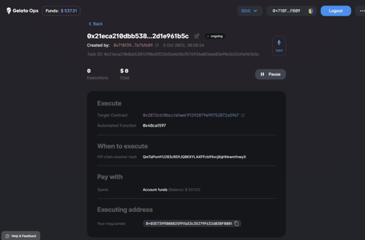

# 🍦 Gelato Off Chain Resolver && 👷 Hardhat

This quick and dirty repo should help devs test V2 off-chain resolvers easily, providing a hardhat instance and the required infrastructure to get up and running.

This repo consists of the [off-chain resolver template](https://github.com/gelatodigital/off-chain-resolver-template) and a hardhat folder with a contract called Lock.sol. This contract locks an amount for one year. We have created a method called "unLock()" that will be called by Gelato OPS, when certain conditions off chain happen.

A short refresher about Gelato:

- execData is the execution payload in bytes that Gelato will execute in our case, the unlock() method
- exexAddress, the address of the deployed contract
- canExec, boolean returned by gelato resolver/off-chain resolver when calling the checker method and tells Gelato to execute or not

&nbsp;

# 🏄‍♂️ Quick Start

## Contract Deployment

### 1) Add the env keys required

```bash
INFURA_ID=INFURA_KEY
CHAINID=31337
RPC_URL=http://localhost:8545
PK=YOUR KEY
```

You need to input our private key (testing) and the infure_Key for the forking Goerli. Change the values in .env-example file and rename it to .env
&nbsp;

### 2) : We open a separate terminal and create a local forked goerli

```javascript
npm run fork
```

### 3) : We compile our contract

```javascript
npm run compile
```

### 4) : We deploy our contract

```javascript
npm run deploy:contract
```

It is worth noticing that the deploy script copies the execData defined into the resolver folder for later building our resolver assembly module

```javascript
let execData = lock.interface.encodeFunctionData("resolverUnLock");
writeFileSync(
  join(process.cwd(), "../resolver/src/contract/execData.ts"),
  `export const  execData = "${execData}";`
);
```

**RECAP**: so far, we have created the contract that we want gelato to execute when the "off chain resolver" meets certain conditions. After that, we will have to create the off-chain resolver assembly module.

## Resolver module

### 5) : Generate the module types

```javascript
npm run codegen
```

### 6) : Build your module

Remember that docker must run on your computer. If not the module wouldn't be able to be built

```javascript
npm run build
```

### 6): deploy your module to IPFS your

```javascript
npm run deploy:resolver
```

As we will need the ipfs-hash later for creating the task, by deploying, we will copy the ipfs-hah to eh hardhat folder

```javascript
const ipfsHash = output.substring(
  i + "wrap://ipfs/".length,
  i + "wrap://ipfs/".length + 46
);
fs.writeFileSync(
  path.join(process.cwd(), "../hardhat/data/ipfsHash.ts"),
  `export const  ipfsHash = "${ipfsHash}";`
);
```

**RECAP**: In this part, we have created our resolver assembly module and uploaded it to ipfs. Great!, everyone can already consume this module! (under the hood, we use polywrapp for creating the assembly module)

## Test e2e (hopp oder top)

At this point, we have all of our ingredients. On the one hand, we have a contract deployed to Goerli. Within the contract there is a method that will nb executed by Gelato ops; and on the other side, we have our assembly module deploy to ipfs (we can think as a kind of cloud function) that polywrap would help us withh it. ,,,,

before we run the test in file [LockResolver.ts](https://github.com/donoso-eth/off-chain/blob/master/hardhat/test/LockResolver.ts).


```javasript
npm run contracts:test
```

Let us go step by step to understand the process

1. First, we deploy pur contract to the goerli forked network

```javascript
const [owner, otherAccount] = await ethers.getSigners();
const Lock = await ethers.getContractFactory("Lock");
const lock = await Lock.deploy(unlockTime, ops, { value: lockedAmount });
```

2. Create an instance of an Ops contract

```javascript
let opsContract: IOps = await IOps__factory.connect(ops, owner);
```

As v2 is still in beta for the off resolver module, we are not going to interact with the Goerli Ops contract, and we will though use the Ops contract with Off chain capabilities

```javascript
"0xc1C6805B857Bef1f412519C4A842522431aFed39"; // goerli Ops contract
"0x03E739ff088825f91fa53c35279F632d038FB081"; // goerli Ops contract with Off Chain functionality
```

As later on, we will execute the task we are required to impersonate the gelato address

```javascript
// opsExec on Goerli
"0x683913B3A32ada4F8100458A3E1675425BdAa7DF";

await network.provider.request({
  method: "hardhat_impersonateAccount",
  params: [opsExec],
});

let executor = await ethers.provider.getSigner(opsExec);
```

We have chosen to pay with the treasury. Therefore, we will have to fund the treasury

```javascript
// treasury address for off-chain resolver
"0xa620799451Fab255A16550776c08Bc461C8F0aBE"
let treasury = new Contract(
      opsTreasury,
      gelato_treasury_abi,
      owner
    ) as ITaskTreasuryUpgradable;

let amount = parseEther("0.1");

let tx = await treasury.depositFunds(owner.address, ETH, amount, {
      value: amount,
    });
```

3. Communicate with the off-chain resolver.  
   &nbsp;So far nothing new. Now is when things start to get interesting. When working previously with gelato, we had a resolver "on-chain", that returned the following object.

```javascript
  { canExec:boolean,
    payload:bytes }
```

If canExec is true, then we execute the payload. With Off chain resolvers the process is the same. However, we are not checking the condition on-chain but off-chain. For doing that we will query a sort of cloud-function (our assembly module), which is stored on IPFS.

We have created our assembly module with poliwrap, so we will have to use the polywrap client to interact.
In our calls we change the blocktimestamp, if is an even number will return canExec = true, (we can change it by creating the task)


```javascript
import { PolywrapClient } from "@polywrap/client-js";

const wrapperUri = `wrap://ipfs/${ipfsHash}`;

const gelatoArgs = {
  gasPrice: "10",
  timeStamp: Math.floor(Date.now() / 1000).toString(),
};

let gelatoArgsBuffer = encode(gelatoArgs);

let job = await polywrapClient.invoke({
  uri: wrapperUri,
  method: "checker",
  args: {
    userArgsBuffer,
    gelatoArgsBuffer,
  },
});
```

that will return `canExec` and `payload`.

4. create the Gelato tasks with the new v2 module features

```javascript
let execSelector = new Lock__factory().interface.getSighash("resolverUnLock");

tx = await opsContract.createTask(lock.address, execSelector, moduleData, ETH, {
  gasLimit: 1000000,
});

await tx.wait();
```

We are requested to pass the moduleData, in our case, as we are working with an off-chain resolver, our module data looks like this

```javascript
let userArgs: { even: boolean } = { even: true };
let userArgsBuffer = encode(userArgs);
let hexargs = `0x${Buffer.from(userArgsBuffer).toString("hex")}`;
let oResolverArgs = encodeOffModulerArgs(ipfsHash, hexargs);

let moduleData = {
  modules: [Module.ORESOLVER], ///Module.ORESOLVER = 4
  args: [oResolverArgs],
};
```

5. So far, so good, now, we will try to test it all together by executing the task if  the polywrap client returns canExec = true

```javascript
      let job = await polywrapClient.invoke({
          uri: wrapperUri,
          method: "checker",
          args: {
            userArgsBuffer,
            gelatoArgsBuffer,
          },
        });

        let error = job.error;
        let data = <{ canExec: Boolean; execData: Bytes}>job.data;

        if (data?.canExec == true) {
          let fee = utils.parseEther("0.1")
            await opsContract
              .connect(executor)
              .exec(
                owner.address,
                lock.address,
                data?.execData,
                moduleData,
                fee,
                ETH,
                true,
                true
              );
        }
```

Hurray! We have deployed, tested, and executed and Off-chain resolver


## Going to real Goerli
I think we are ready for our next vow effect!!

1) In the hardhat.config.ts change the defaultnetwork to goerli
2) ```npm run deploy:contract```
3) copy the deployed address to the create-task task file
4) ```npm run task create-task```
   
For the dpeloyment and the interaction with goerli we will use the user privided throug the PK in the .env file. (ensure that a t least 0.2 eth goerli are available for the deployment and fund gelato treasury)

and boom... the we can see our task in the gelato [beta ui](https://beta.app.gelato.network/task/0x21eca210dbb5381298bd2f22b5bde28cf574926a026e603e9fe3b32d1e961b5c?chainId=5)

